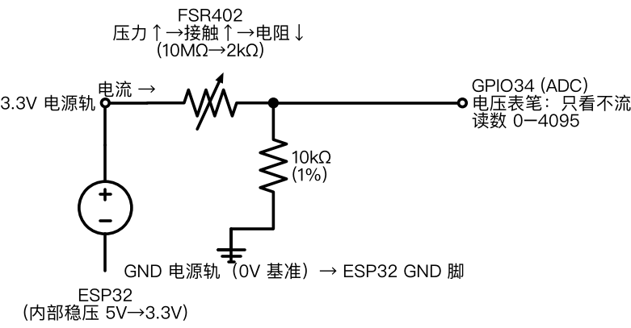
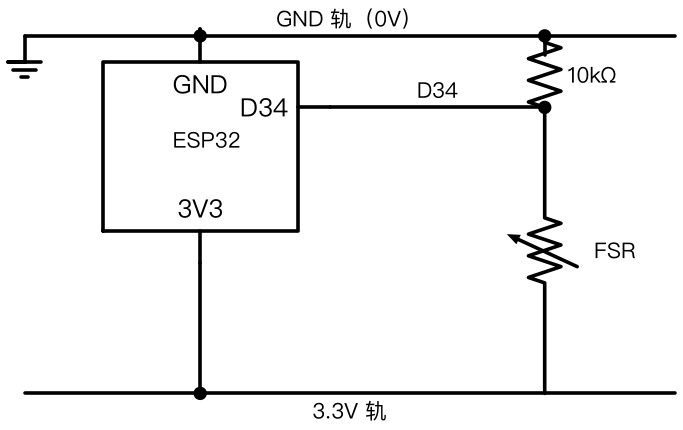
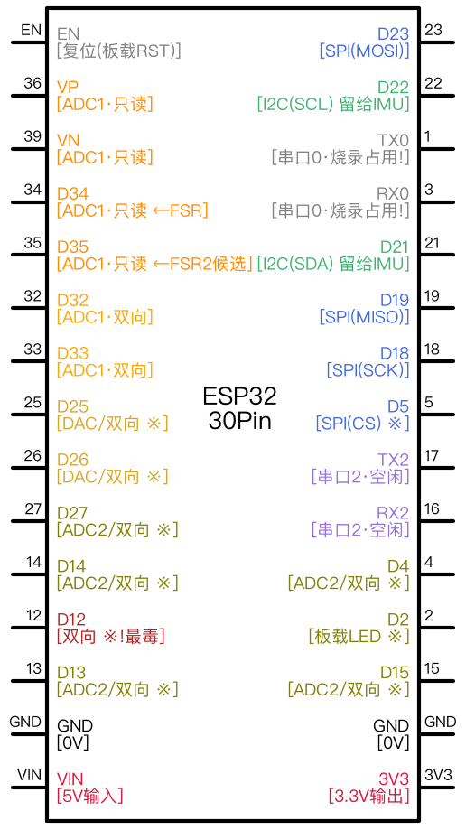

# V1 首读全链路原理（实操后补课，2026-09-15）

> 定位：09-15 凌晨实操验收后的理论补课（用户原则：AI 可超前，事后必须理解）。六层地图：物理→电路→器件→数字→软件→链路。所有数字标来源；【AI 补充】= 未经原始文档核实的惯例性说明。

## 六层地图

```
①物理层  压力 → 电阻        （FSR 膜片里发生的事）
②电路层  电阻 → 电压        （分压 + 电流回路）
③器件层  ESP32 是什么       （芯片/开发板/引脚分类）
④数字层  电压 → 数字        （ADC 采样）
⑤软件层  固件/程序在跑什么   （刷机烧了什么、main.py 循环）
⑥链路层  数字 → 屏幕        （串口→USB→Python→曲线）
```

## ① FSR：压力 → 电阻（物理）

【数据手册 PDS-10004-C】两片聚合物膜三明治：下膜印**叉指电极**（两手手指交叉不接触），上膜涂半导体涂层，各引一线（无极性）。

- 无压：贴合松、缝隙多 → 电阻 >10MΩ；
- 受力：接触面积↑ → 接通的指缝（并联路径）↑ → 总电阻↓，重压 ~2kΩ。

**本质：压力 → 接触面积 → 并联路径数 → 电阻**（靠接触，不靠金属形变——区别于应变片）。

推论三脾气：非线性（R-F 幂律）、迟滞 ±10%、漂移 → **信形状不信绝对值**（当「有没有/怎么变」的传感器，不当「几牛顿」的仪器）。与 OpenExo 用 FSR 判相位同构。

## ② 分压：电阻 → 电压（为什么 + 三个为什么）

ADC 只认电压不认电阻 → 需要翻译。I = 3.3/(R_FSR+10k)，中点电压 = 3.3×10k/(R_FSR+10k)。

| 状态 | R_FSR | 中点 | 读数≈ |
|---|---|---|---|
| 没压 | >10MΩ | 0.003V | 0 |
| 轻压 | 10k | 1.65V | 2000 |
| 重压 | 2k | 2.75V | 3400 |

- **为什么 FSR 朝 3.3V 端**：方向=语义（越压越大，正逻辑）；反接合法但读数反向。
- **为什么 10k**【报告 20260910 §9.1，AI 设定】：FSR 跨 2k~10M 四个数量级，10k 在对数中点附近，轻~中压段落进电压窗口。1k 太小、1M 太大。
- **回路电流**：最大 0.28mA（3.3/12k）——「小信号可带电」与「电机必断电」的分界。

**回路心智模型**：电流走大环（3V3→轨→FSR→中点→10k→GND轨→GND脚）；橙线只在中点「看一眼」——ADC 输入阻抗极高（采样电容 pF 级【AI 补充】），不取电流不扰分压。**压力之路与观察之路分开**；共地不可省（电压=相对 GND 的高度，无共同基准则读数无意义）。

## ③ ESP32：芯片与开发板解剖

**芯片**（SoC）：双核 240MHz + WiFi/BT + RAM + 外设【选型页】= 无屏迷你电脑，程序存旁挂 flash。

**开发板** = 芯片 + 四设施：
1. 稳压器 5V→3.3V（3V3 脚即其输出；常见 AMS1117【AI 补充】）；
2. CH340C：USB↔串口，刷机+数据全走它；
3. EN/BOOT 按键：复位/刷机模式；
4. 天线+排针。

**30 脚分类**（按用途记）：

| 类 | 例 | 说明 |
|---|---|---|
| 电源 | 3V3/VIN/GND×n | GND 全板相通 |
| 普通 GPIO | 4/5/13/15… | 可入可出 |
| **仅输入** | **34/35/36/39** | 无输出驱动无上拉，天生接传感器【ESP32 数据手册】 |
| 串口 | TX0/RX0 | 连 CH340 |
| 特殊 | EN/BOOT | 复位/启动模式 |

选 34 的理由【AI 补充】：仅输入最干净；属 ADC1（ADC2 开 WiFi 即废）。

## ④ ADC：电压 → 数字

12 位 = 4096 档，1 档 ≈ 0.8mV；`ATTN_11DB` 扩量程到 3.3V【MicroPython 文档】。ESP32 ADC 出名非线性【AI 补充】→ 不换算回牛顿，与 ① 叠加成双保险。100Hz：脚部几 Hz、上升沿几十 ms → 上升沿 5~20 点；实测 ~11ms/点（循环开销），量级够用——标称≠实测。

## ⑤ 烧录分层：刷了什么

```
flash：0x1000=第二级 bootloader → 分区表+MicroPython(~1.7MB) → 文件区 main.py
```

- `erase_flash` 清空全片；`write_flash 0x1000` 写 MicroPython；
- 进刷机模式靠 DTR/RTS 自动复位电路（不用按 BOOT）；460800 波特率灌半分钟；
- **MicroPython = 把 Python 解释器刷成「操作系统」**，硬件封装成 machine.ADC/Pin，固件因此只有十几行；
- 开机自动跑 main.py：配 34 脚 → 循环「采一次打印一行」睡 10ms。

## ⑥ 信号链全景

压力 →FSR 电阻↓[Ω] →分压电压↑[V] →ADC[0-4095] →main.py 串口 115200 →CH340→USB→/dev/cu.usbserial-110 →Python 环形缓冲→PNG →浏览器刷新→眼睛。**六次简单翻译，指尖连上屏幕**；排错=从屏幕倒回找断环。

## ⑦ 排错复盘（原理级）

GPIO34 悬空 → ADC 采样电容无充放电路径 → 电荷随机漂移 → 0/4095 乱跳（而非稳定 0）。「有确定参考路径」= 读数有意义的充要条件。

## 裸重演三题（掌握判定用）

1. 白纸画完整电路（ESP32 三脚/两轨/FSR/10k），标电流路径与 34 位置；
2. FSR=4kΩ 时中点电压与读数（口算）；
3. 为什么悬空是乱跳不是平稳 0？

## 绘图工具（2026-09-16）

原理图改用 schemdraw（Python 文本→PNG，中文标签 OK）：~/code/exo-fsr/draw_v1_schematic.py（修正版参照图 web/v1_schematic.png）。选型：原理图=schemdraw；交互仿真=Falstad CircuitJS（网页）；时序图=wavedrom（L4 备用）；面包板实物图无成熟文本方案，暂用 HTML/SVG 手绘。ASCII 电路图弃用（用户反馈看不懂）。

## 勘误（2026-09-16）

AI 初读用户手绘 v1 电路图时误判为「FSR/10k 反接版」——实际图中 FSR、3V3 引线跨越 GND 轨处画有**跨线弧（不连接的交叉）**，是标准原理图符号；v1 拓扑与实物接线完全一致。后果：误要求「重画修正版」、虚构「反接版口算」教学框架（口算本身数学有效，但前提是假想电路）。教训：①AI 读手绘图存在视觉误判风险，关键结论须与用户对质；②用户以实物接线为据提出异议时，第一反应应是复核而非辩护。

## 节点表与电路图等价（2026-09-16）

电路图唯一携带的信息=连接关系（节点表）；线的长短/弯折/位置/元件画法均不携带。两张图等价 ⇔ 节点表逐行相同。V1 节点表：N0=0V（ESP GND 脚、GND 轨、10k 下端）；N1=3.3V（ESP 3V3 脚、3.3V 轨、FSR 上端）；N2=中点（FSR 下端、10k 上端、D34）。手绘布局式 / schemdraw 原理图式逐行一致 → 等价。三个简化术：方框→电源符号（只画用到的端子）、长轨→短线（导线长度无意义）、回线→接地符号（0V 不画全）。唯一不能省的：交叉不连接要画跨线弧，连接要画节点圆点。

## ESP32 引脚地图（2026-09-16）

30Pin DevKit 引脚地图（按功能着色）：http://mini:8322/esp32_pinout.png（图例 esp32_pinout_legend.png），源码 ~/code/exo-fsr/draw_esp32_pinout.py。要点：GPIO=通用输入输出脚编号，丝印 D34=GPIO34 同一物理脚；34/35/36/39 只读；ADC1(32-39) 随时可用、ADC2 WiFi 开则失效；strapping 五脚 0/2/5/12/15 上电敏感；I2C=21/22 留给 IMU；第二片 FSR 候选 D35。

## 配图集（2026-09-16 归档）









